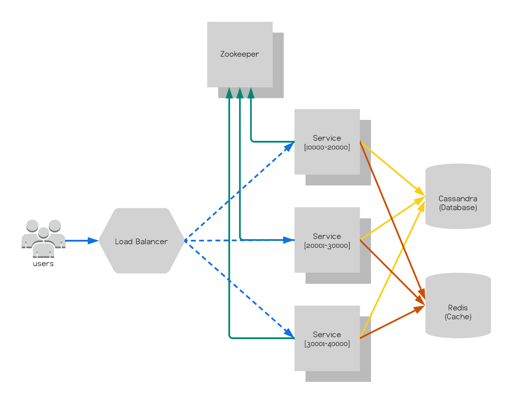

# Shortlink

Highly available and scalable URL shortening service.

## Table of contents

- [Overview](#overview)
- [Architecture](#architecture)
  - [Requirements](#requirements)
    - [Functional](#functional)
    - [Non-Functional](#non-functional)
  - [Desisions](#desisions)
    - [Microservices](#microservices)
    - [Hashing](#hashing)
    - [Database](#database)
    - [Tools](#tools)
- [Contact](#contact)

# Overview

Shortlink is a highly scalable and available service that allows users to shorten URLs for easy sharing, in addition to receiving various metrics on incoming hits.

# Architecture

## Requirements

### Functional 

- Given a URL, the service should generate a link short enough to be easily copied and shared between applications and users.
- When users access a short link, the service should redirect them to the original link. 
- Users should be able to access metrics about their link redirects..
- The service should also be accessible through REST APIs by other services.

### Non-Functional

- The system should be highly available, because if the service is down, all URL redirections will start failing. 
- URL redirection should happen with minimal latency. 

## Desisions

### Microservices

As one of the non-functional requirements of the application requires a highly available service, the microservices architecture will be better adapted by distributing the responsibilities among several services, allowing an easy horizontal scalability that will consequently decrease the downtime, reaching 99.999% availability.

|  | 
|:--:| 
| *The above representation image rules out authentication systems, metric services and log services.* |

### Hashing

To write a new URL in the storage system without selecting and checking if it already exists in the database, the chosen solution is to use a service that will allow you to create a range of integers, for example [1-10,000] for each service, so , the chance of collision between URLs is reduced by 100%. But this solution can bring another problem, a single point of failure. To solve this, the tool chosen was Zookeeper, basically because it is a distributed and high-performance service.

#### URL Length

Using the base62 encoding scheme it will be possible to get approximately 3.8 trillion unique URLs.

Base62 - [A-Z,a-z,0-9] 62 characters

62^7 = 3.521.614.606.208 possibilities

Ex: shorturl.example/a58BT17u

### Database

This service is read-heavy, that is, it has more read requests than writes, and it doesn't have many relationships between the data. Therefore, the best option for this use case is to use a non-relational (NoSQL) storage system, which allows for data storage in a distributed manner. Consequently, the database chosen was Cassandra, another advantage of using it is the amount of data that will be stored in the system (approximately 3.8 trillion pieces of data).

### Tools

- [Go (Golang)](https://golang.org/)
- [Cassandra](https://cassandra.apache.org)
- [Zookeeper](https://zookeeper.apache.org/)
- [Kafka](https://kafka.apache.org/)
- [Docker](https://www.docker.com/)
- [Kubernetes](https://kubernetes.io/)