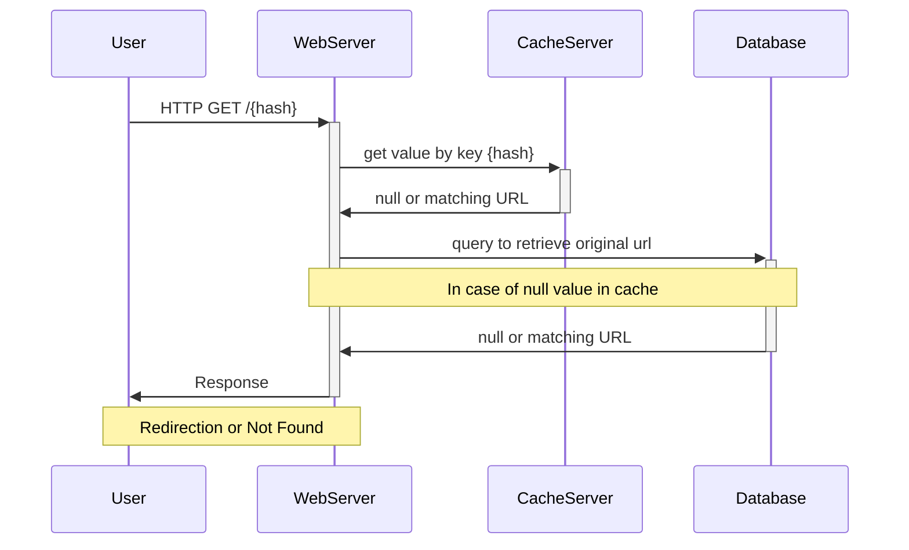

# ShortLink

Highly available and scalable URL shortening service.

[](https://skillicons.dev)

## Table of contents

- [Overview](#overview)
- [Architecture](#architecture)
  - [Requirements](#requirements)
    - [Functional](#functional)
    - [Non-Functional](#non-functional)
  - [Decisions](#decisions)
    - [Tools](#tools)
    - [Microservices](#microservices)
    - [Hashing](#hashing)
    - [Database](#database)
    - [Caching](#caching)
- [Development](#development)
  - [Setup](#setup)
    - [Keycloak](#keycloak)
    - [Cassandra](#cassandra)
    - [Redis](#redis)
    - [Zookeeper](#zookeeper)
    - [Kafka](#kafka)
    - [Start Server](#start-server)
- [Contact](#contact)

# Overview

Shortlink is a highly scalable and available service that allows users to shorten URLs for easy sharing, in addition to receiving various metrics on incoming hits.

# Architecture

## Requirements

### Functional 

- Given a URL, the service should generate a link short enough to be easily copied and shared between applications and users.
- When users access a short link, the service should redirect them to the original link. 
- Users should be able to access metrics about their link redirects.
- The service should also be accessible through REST APIs by other services.

### Non-Functional

- The system should be highly available, because if the service is down, all URL redirections will start failing. 
- URL redirection should happen with minimal latency. 

## Decisions

### Tools

- [Go (Golang)](https://golang.org/)
- [Cassandra](https://cassandra.apache.org)
- [Redis](https://redis.io/)
- [Zookeeper](https://zookeeper.apache.org/)
- [Keycloak](https://www.keycloak.org/)
- [Kafka](https://kafka.apache.org/)
- [Docker](https://www.docker.com/)
- [Kubernetes](https://kubernetes.io/)
- [GitHub Actions](https://github.com/features/actions)

### Microservices

As one of the non-functional requirements of the application requires a highly available service, the microservices architecture will be better adapted by distributing the responsibilities among several services, allowing an easy horizontal scalability that will consequently decrease the downtime, reaching 99.999% availability.

|  | 
|:--:| 
| *The above representation image rules out authorization system, metric services and log services.* |

### Hashing

To write a new URL in the storage system without selecting and checking if it already exists in the database, the chosen solution is to use a service that will allow you to create a range of integers, for example [1-10,000] for each service, so , the chance of collision between URLs is reduced by 100%. But this solution can bring another problem, a single point of failure. To solve this, the tool chosen was Zookeeper, basically because it is a distributed and high-performance service.

#### URL Length

Using the base62 encoding scheme it will be possible to get approximately 3.8 trillion unique URLs.

Base62 - [A-Z,a-z,0-9] 62 characters

62^7 = 3.521.614.606.208 possibilities

Ex: shorturl.example/a58BT17u

Therefore, a hash length of 7 characters is enough for creating multiple URLs and at the same time short enough for easy sharing.

### Database

This service is read-heavy, that is, it has more read requests than writes, and it doesn't have many relationships between the data. Therefore, the best option for this use case is to use a non-relational (NoSQL) storage system, which allows for data storage in a distributed manner. Consequently, the database chosen was Cassandra.

Cassandra is an open source NoSQL distributed database designed to handle large amounts of data across multiple servers, providing high read and write throughput.

### Caching

Caching is an efficient way to improve the performance of reads on the system, reducing the load on the database server. 

Since one of the system requirements is the minimum latency in redirecting URLs, the caching service is essential, given the fact that retrieving data from the database server is a time-consuming process. Therefore, when implementing a cache system it is possible to store the hash and the respective URL in an in-memory data store, allowing much faster access.


*The representation image above shows the flow of a GET request using the cache layer.*

For this, redis was the chosen data store, due to its powerful distributed caching mechanism that provides key-value pair caching with very low latency, among other features.

## Development

***OBS: follow these steps only for development environment.***

### Setup

1. clone the repository 
```sh
git clone https://github.com/hugosrc/shortlink.git
```

2. change directory
```
cd shortlink
```

3. copy the environment variables 
```sh
cp .env.example .env
```

#### Keycloak

1. start docker container 
```
docker compose up -d keycloak
```

2. Access in the browser: http://localhost:8080
3. Access the Administration Console
4. Sign in. ```user: admin password: admin```
5. Create a Realm
6. In Resource file, click on browse file and select the [shortlink-realm.json](/keycloak/scripts/shortlink-realm.json) file, then press the create button
7. In Clients, select link-service credentials and regenerate the client secret

#### Cassandra

1. start docker container 
```
docker compose up -d cassandra
```

2. Run the queries below on the cassandra database server

```sql
CREATE KEYSPACE shortlink 
  WITH REPLICATION = { 
    'class' : 'SimpleStrategy', 
    'replication_factor' : 1 
    };

CREATE TABLE shortlink.url_mapping (
  hash VARCHAR,
  original_url VARCHAR,
  user_id UUID, 
  creation_time TIMESTAMP,
  PRIMARY KEY (hash)
);

CREATE INDEX user_idx ON shortlink.url_mapping (user_id);
```

#### Redis

1. start docker container 
```
docker compose up -d redis
```

#### Zookeeper

1. start docker container 
```
docker compose up -d zookeeper
```

#### Kafka

To create kafka, it is recommended to start a cluster on [Confluent Cloud](https://confluent.cloud/), using the free service available.

1. go to the [Confluent Cloud](https://confluent.cloud/) website

2. perform signin/signup

3. create a default kafka cluster

4. create kakfa cluster API key

5. set the received values to the following environment variables.`KAFKA_BOOTSTRAP_SERVERS, KAFKA_SASL_USERNAME, KAFKA_SASL_PASSWORD`

6. create a new topic and set it to the environment variable `KAFKA_METRICS_PRODUCER_TOPIC_NAME`

Well, now let's proceed.

#### Start Server

All done, now just start the server 
```sh
go run cmd/api/main.go
```

## Contact

You can reach me on my [LinkedIn](https://www.linkedin.com/in/hugosrc/)
